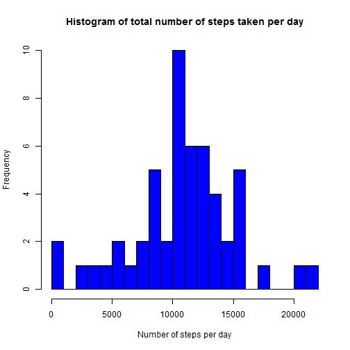
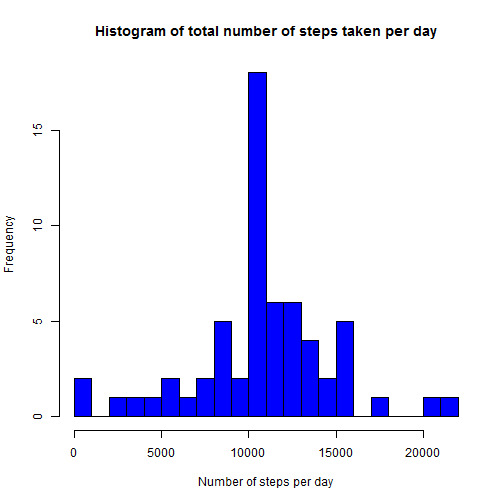
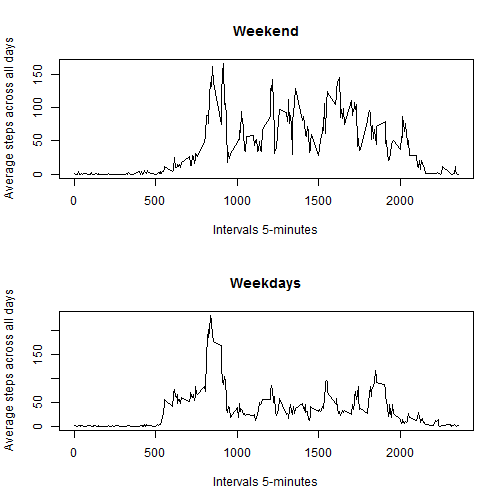

Reproducible Research - Peer Assesment 1
========================================================

# Introduction

It is now possible to collect a large amount of data about personal movement using activity monitoring devices such as a Fitbit, Nike Fuelband, or Jawbone Up. These type of devices are part of the "quantified self" movement - a group of enthusiasts who take measurements about themselves regularly to improve their health, to find patterns in their behavior, or because they are tech geeks. But these data remain under-utilized both because the raw data are hard to obtain and there is a lack of statistical methods and software for processing and interpreting the data.

This assignment makes use of data from a personal activity monitoring device. This device collects data at 5 minute intervals through out the day. The data consists of two months of data from an anonymous individual collected during the months of October and November, 2012 and include the number of steps taken in 5 minute intervals each day.
You can refer to www.coursera.org for futher information.


## Loading and preprocessing the data


```r
activity_data <- read.csv("activity.csv",sep=",",header=TRUE)
```

## What is mean total number of steps taken per day?


```r
stepsbyday <- aggregate (activity_data$steps ~ activity_data$date,FUN=sum )
options(scipen=20)
meanbyday <- round(mean(stepsbyday[,2]),digits = 2)
medianbyday <- median(stepsbyday[,2])
hist(stepsbyday[,2],col="BLUE",freq= TRUE,breaks=20,xlab= "Number of steps per day",main = "Histogram of total number of steps taken per day")
```

 

The mean of the total number of steps taken per day is 10766.19

The median of the total numer of steps taken per day is 10765
 
## What is the average daily activity pattern?


```r
activity_pattern <- aggregate(activity_data$steps ~ activity_data$interval,FUN=mean)
plot(activity_pattern[,1],activity_pattern[,2],type="l",xlab="Intervals 5-minutes",ylab="Average steps across all days")
```

 

```r
max_interval <- activity_pattern[which(activity_pattern[,2] == max(activity_pattern[,2])),1]
```
  
The 5-minute interval, on average across all the days in the dataset, that contains the maximum number of steps is 835

## Imputing missing values

```r
missing <- sum(is.na(activity_data$steps))
```


The total number of missing values in the dataset (total number of rows with NA´s ) is 2304

The missing values in the dataset will be filled by the mean for that 5-minute interval.

A new dataset that is equal to the original dataset but with the missing data filled in will be created.


```r
activity_data_2 <- activity_data

for(i in 1:nrow(activity_data_2)){
   if( is.na(activity_data_2$steps[i]) == TRUE){
       interval <- activity_data_2$interval[i]
       interval_mean <- activity_pattern[which(activity_pattern[,1] ==interval),2]
       activity_data_2$steps[i] <- interval_mean
       }
  }
```

With the new activity data set completed (activity_data_2), the mean and median are again calculated.


```r
stepsbyday_2 <- aggregate (activity_data_2$steps ~ activity_data$date,FUN=sum )
options(scipen=20)
meanbyday_2 <- round(mean(stepsbyday_2[,2]),digits = 2)
medianbyday_2 <- median(stepsbyday_2[,2])
hist(stepsbyday_2[,2],col="BLUE",freq= TRUE,breaks=20,xlab= "Number of steps per day",main = "Histogram of total number of steps taken per day")
```

 

The mean of the total number of steps taken per day is 10766.19

The median of the total numer of steps taken per day is 10766.1887

From the experiment, we can infer that the mean is not affected by filling the missing values in the dataset by the mean for that 5-minute interval. However the median is slightly changed and converges to the mean value.

The histogram shape remains similar, although the number of steps is increased by using the activity dataset with imputed values.

## Are there differences in activity patterns between weekdays and weekends?


```r
activity_data_2$date <- as.Date(activity_data_2$date)
activity_data_2$day <- weekdays(activity_data_2$date)
activity_data_2$daytype <- "weekday"
activity_data_2$daytype[format(activity_data_2$date, "%u") %in% c(6, 7)] <- "weekend"

par(mfrow = c(2, 1))

activity_data_2_weekend <- subset (activity_data_2,activity_data_2$daytype =="weekend" )
activity_data_2_weekday <- subset (activity_data_2,activity_data_2$daytype =="weekday" )

activity_pattern_2_weekend<- aggregate(activity_data_2_weekend$steps ~ activity_data_2_weekend$interval,FUN=mean)

plot(activity_pattern_2_weekend[,1],activity_pattern_2_weekend[,2],type="l",xlab="Intervals 5-minutes",ylab="Average steps across all days",main ="Weekend")

activity_pattern_2_weekday <- aggregate(activity_data_2_weekday$steps ~ activity_data_2_weekday$interval,FUN=mean)

plot(activity_pattern_2_weekday[,1],activity_pattern_2_weekday[,2],type="l",xlab="Intervals 5-minutes",ylab="Average steps across all days",main ="Weekdays")
```

 


